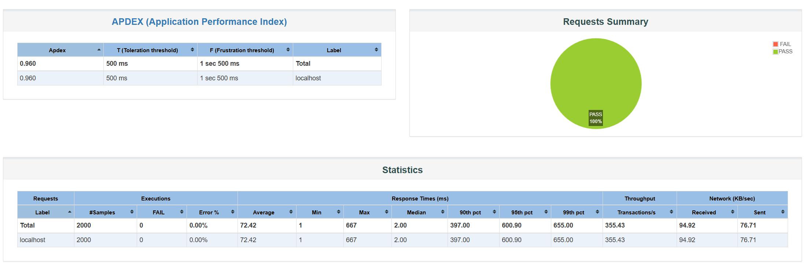

# Token Bucket Rate Limiter

A backend rate-limiting service built with Java and Spring Boot, supporting two interchangeable rate-limiting algorithms (Token Bucket and Sliding Window), configurable per client, backed by PostgreSQL persistence, and verified under concurrent load using JMeter.



## Table of Contents

- [Overview](#overview)
- [Why This Project](#why-this-project)
- [Architecture](#architecture)
- [Rate Limiting Algorithms](#rate-limiting-algorithms)
- [API Reference](#api-reference)
- [Concurrency Safety](#concurrency-safety)
- [Persistence Strategy](#persistence-strategy)
- [Testing](#testing)
- [Load Testing](#load-testing)
- [Tech Stack](#tech-stack)
- [Running Locally](#running-locally)
- [Project Structure](#project-structure)
- [Design Decisions and Tradeoffs](#design-decisions-and-tradeoffs)
- [Possible Extensions](#possible-extensions)

## Overview

This service exposes a REST API that answers a single question for any client: is this request allowed right now, or should it be denied? It supports:

- A `POST` endpoint to check whether a given client's request should be allowed or denied
- Per-client configurable limits, set via admin endpoints
- Two selectable rate-limiting algorithms per client: Token Bucket and Sliding Window
- Bucket/window state that survives a service restart, backed by PostgreSQL
- Thread-safe handling of concurrent requests for the same client, with no risk of over-allowing requests
- Standard rate-limit response headers (`X-RateLimit-Limit`, `X-RateLimit-Remaining`, `X-RateLimit-ResetSeconds`)
- A load test proving correctness under concurrent load at scale

## Why This Project

Rate limiting is a core building block behind almost every production API, GitHub, Twitter/X, and most internal microservice-to-microservice traffic all rely on some form of it to protect backend resources from being overwhelmed by a single client, whether due to a bug, a retry storm, or intentional abuse. It is also one of the more common system design and backend interview topics, since a correct implementation has to reconcile several concerns at once: algorithmic correctness, thread safety, persistence, and performance under load.

This project was built to work through each of those concerns individually and prove each one with a test, rather than assuming correctness.

## Architecture

The service uses the Strategy pattern to keep the two rate-limiting algorithms fully interchangeable behind a common interface, and a small factory to resolve which strategy a given client should use.

```
                         HTTP Request
                              |
                              v
                    RateLimitController
                    (validates request,
                     builds HTTP response
                     and headers)
                              |
                              v
                     RateLimitService
              (orchestrator: looks up which
               algorithm a client is configured
               for, delegates accordingly)
                              |
                              v
                RateLimitStrategyFactory
              (resolves the correct Strategy
                 bean for a given algorithm)
                        /          \
                       v            v
          TokenBucketStrategy   SlidingWindowStrategy
          (owns its own map      (owns its own map of
           of client -> bucket    client -> sliding
           state; persists to     window state, held
           PostgreSQL via a       fully in memory)
           scheduled sync job)
```

**Why this separation matters:** the Controller and Service never need to know which algorithm is actually being used for a given client. Each Strategy implementation owns its own internal state (a `TokenBucket` object with token counts and timestamps, or a `Deque` of request timestamps for Sliding Window) and its own concurrency handling. Adding a third algorithm in the future would mean adding one new Strategy implementation and one new case in the factory, nothing else in the request path would need to change.

## Rate Limiting Algorithms

### Token Bucket

Each client has a bucket with a maximum capacity (burst size) and a refill rate (tokens added per second). Every request consumes one token if available; if the bucket is empty, the request is denied. Tokens are replenished lazily, refill amount is calculated from elapsed time on each request, rather than via a background thread, which avoids timer drift and unnecessary scheduled work for idle clients.

This algorithm tolerates short bursts (a client that has been idle can use up its full capacity at once) while still enforcing a steady average rate over time.

### Sliding Window

Each client's recent request timestamps are tracked in a deque. On each request, timestamps older than the configured window are trimmed from the front of the deque, and the request is allowed only if the number of remaining timestamps is below the configured maximum. This enforces a stricter, smoother limit than Token Bucket, since it does not allow accumulated "saved up" bursts, only the genuine count of requests within the trailing time window matters.

### Choosing between them

Token Bucket is generally preferable when occasional bursts from a legitimate client are expected and acceptable. Sliding Window is preferable when a strict, consistent cap on recent activity matters more than burst tolerance, for example, login attempt limiting or fraud-sensitive endpoints.

## API Reference

### Check a request

```
POST /api/rate-limiter/check
Content-Type: application/json

{
  "clientId": "some-client-id"
}
```

Returns `202 Accepted` with `{"status": "ALLOW"}` if the request is allowed, or `429 Too Many Requests` with `{"status": "DENY"}` if it is not.

Every response includes:

| Header | Meaning |
|---|---|
| `X-RateLimit-Limit` | The client's configured capacity (Token Bucket) or maximum requests per window (Sliding Window) |
| `X-RateLimit-Remaining` | Requests/tokens currently available |
| `X-RateLimit-ResetSeconds` | Seconds until at least one more request will be allowed |

### Configure a client for Token Bucket

```
POST /api/rate-limiter/admin/config/token-bucket
Content-Type: application/json

{
  "clientId": "some-client-id",
  "capacity": 20,
  "refillRatePerSecond": 5
}
```

### Configure a client for Sliding Window

```
POST /api/rate-limiter/admin/config/sliding-window
Content-Type: application/json

{
  "clientId": "some-client-id",
  "windowSizeSeconds": 10,
  "maxRequests": 5
}
```

Calling either admin endpoint both sets that client's limits and switches them to the corresponding algorithm. If a client has never been configured, they default to Token Bucket with a capacity of 10 and a refill rate of 2 tokens per second.

## Concurrency Safety

Multiple threads can legitimately call `tryConsume` for the same client at nearly the same instant, for example, retries from a client-side HTTP library, multiple devices under the same account, or multiple instances of a calling service. Without protection, this creates a classic check-then-act race condition: two threads can both read the same token count before either writes back the decremented value, allowing more requests through than the configured limit permits.

This is addressed at two points:

1. **Per-client locking on the request path.** Each algorithm's consume logic is wrapped in a `synchronized` block scoped to that specific client's state object (the `TokenBucket` instance or the timestamp deque), not a single global lock. This means concurrent requests for different clients never block each other, while concurrent requests for the *same* client are correctly serialized.

2. **Atomic get-or-create on the initialization path.** The first request for a brand-new client involves checking the database, and if no row exists, inserting one. Under concurrent load, multiple threads can reach this path simultaneously for a client's very first request. This is handled using `ConcurrentHashMap.computeIfAbsent`, which guarantees the creation logic runs at most once per key even when called concurrently from many threads, preventing duplicate-key database errors.

Both of these were specifically verified, not assumed, see [Testing](#testing) and [Load Testing](#load-testing) below.

## Persistence Strategy

Bucket state needs to survive a service restart, but a live database round-trip on every single request would defeat the purpose of an in-memory rate limiter and add unacceptable latency under load. This project uses a cache-aside pattern:

- All active bucket state lives in a `ConcurrentHashMap` in memory, which is what every request actually reads and writes against.
- A scheduled background job (`@Scheduled`, running every 5 seconds) periodically syncs the current in-memory state for every active client to PostgreSQL.
- When a client is seen for the first time after a restart, their state is loaded from PostgreSQL into memory on first access, rather than starting fresh.

This means a small window of state (up to 5 seconds) could theoretically be lost in the event of an unclean crash. For a rate limiter, this is an acceptable tradeoff, a client briefly having slightly more or fewer tokens than perfectly accurate after a crash is a non-issue compared to the cost of synchronous persistence on every request.

## Testing

The project includes unit and integration tests covering each requirement independently:

- Default bucket behavior (capacity and refill rate enforcement)
- Per-client configuration overrides
- Bucket state surviving a service restart (verified by directly inspecting and modifying persisted rows, then confirming the running service picks up the modified values)
- Concurrency safety under simulated concurrent access, using a thread pool and a `CountDownLatch` to force many threads to call the same method at the same instant, asserting that the number of successful requests never exceeds the configured capacity even at thousands of concurrent threads
- Sliding Window correctness, including window expiry over time
- Rate-limit header correctness for both algorithms, including the reset-time calculation

Each test intentionally uses a unique client identifier to avoid state leaking between test runs, since the same `ConcurrentHashMap` and database rows are shared across the test suite.

## Load Testing

Correctness under concurrency was additionally verified against the fully running application over real HTTP, using Apache JMeter, rather than relying solely on in-process unit tests.

**Configuration:** 2,000 concurrent threads, ramped up over 5 seconds, each firing a single request against a client configured with a known capacity.

**Result:** 100% of requests completed successfully with zero connection errors. Every request that should have been allowed based on the configured capacity was allowed, and every request beyond that capacity was correctly denied with a `429` response, confirming no over-allowance occurred even under sustained concurrent load.

Reaching this result also surfaced a genuine bug during development: an early version of the client initialization logic had its own check-then-act race condition (separate from the already-handled token-consumption race), which caused duplicate-key database errors when many threads simultaneously requested a brand-new client for the first time. This was fixed by moving the entire get-or-create sequence inside `ConcurrentHashMap.computeIfAbsent`, and the fix was confirmed by rerunning the same load test cleanly afterward. This is a good example of why load testing at the HTTP layer matters even after unit tests pass, some races only appear on code paths that unit tests don't happen to exercise concurrently.

A summary of the final run:

| Metric | Result |
|---|---|
| Concurrent threads | 2,000 |
| Ramp-up period | 5 seconds |
| Error rate | 0.00% (0 of 2,000 requests) |
| APDEX score | 0.960 (500 ms / 1,500 ms thresholds) |
| Average response time | 72.42 ms |
| Median response time | 2 ms |
| 90th percentile | 397 ms |
| 95th percentile | 600.90 ms |
| 99th percentile | 655 ms |
| Min / Max response time | 1 ms / 667 ms |
| Throughput | 355.43 requests/sec |
| Correctness | No client ever exceeded its configured limit |

The gap between the median (2 ms) and the higher percentiles (397–655 ms) reflects the ramp-up period: requests fired early in the 5-second window, before all 2,000 threads had started, return almost immediately, while requests fired once the full concurrent load is active take longer as they contend for the same client's lock and the shared connection pool. This is expected under a deliberate concurrent burst and does not indicate an issue with individual request handling.

The full interactive JMeter dashboard report, including per-endpoint breakdowns and time-series graphs, is included in this repository at `/load-test-report/index.html`, clone the repository and open that file directly in a browser to view it (it is a static report and does not require the service to be running).

## Tech Stack

- Java 17
- Spring Boot 3.x (Web, Data JPA, Validation)
- PostgreSQL
- Maven
- JUnit 5
- Lombok
- Apache JMeter (load testing)

## Running Locally

**Prerequisites:** Java 17, Maven, a running PostgreSQL instance.

1. Create a database:
   ```sql
   CREATE DATABASE ratelimiter;
   ```

2. Configure `src/main/resources/application.properties`:
   ```properties
   spring.datasource.url=jdbc:postgresql://localhost:5432/ratelimiter
   spring.datasource.username=YOUR_USERNAME
   spring.datasource.password=YOUR_PASSWORD
   spring.jpa.hibernate.ddl-auto=update
   ```

3. Run:
   ```bash
   mvn spring-boot:run
   ```

4. The service starts on `http://localhost:8080`.

## Project Structure

```
src/main/java/com/kshitij/ratelimiter/
├── controller/         REST endpoints
├── service/             Orchestration, Strategy implementations, Strategy factory
├── model/               In-memory domain objects (TokenBucket, SlidingWindow)
├── entity/              JPA entities for persistence
├── repository/          Spring Data JPA repositories
├── dto/                 Request/response payloads
└── enums/                RateLimitAlgorithm
```

## Design Decisions and Tradeoffs

- **Cache-aside over write-through persistence:** chosen to keep the hot path fast; see [Persistence Strategy](#persistence-strategy).
- **Per-client `synchronized` locking over a single global lock:** a global lock would serialize all clients behind one another regardless of whether they actually contend for the same resource, which would not scale under real concurrent traffic from many distinct clients.
- **Manual field mapping over a mapping library:** with only four fields per model, a small library like ModelMapper would add a dependency and reflection overhead without meaningfully reducing code, so conversion between in-memory models and JPA entities is done with two small, explicit methods.
- **Separate admin endpoints per algorithm rather than one generic endpoint:** Token Bucket and Sliding Window have fundamentally different configuration shapes (capacity/refill rate versus window size/max requests). Two well-typed endpoints, each fully validated, were chosen over one endpoint with conditionally-required fields.

## Possible Extensions

- Tiered configuration presets (e.g., Free/Pro/Enterprise defaults) layered on top of the existing per-client configuration mechanism
- Distributed rate limiting across multiple service instances, using a shared store such as Redis instead of per-instance in-memory state
- A metrics/observability endpoint exposing current bucket state across all clients for operational visibility
